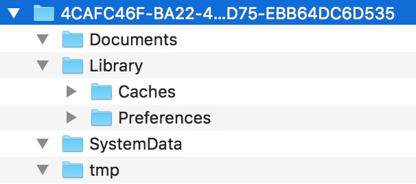

# 如何获取 iOS App 的沙盒路径

对于一个 App, 它的沙盒内容如下




获取沙盒的 Home 路径，即 `4CAFC...` 开头的这个目录

```objc
NSString *homeDir = NSHomeDirectory();
```

获取 Documents 目录

```objc
NSArray *paths = NSSearchPathForDirectoriesInDomains(NSDocumentDirectory, NSUserDomainMask, YES);
NSString *docDir = [paths objectAtIndex:0];
```

获取 Library/Caches 目录

```objc
NSArray *paths = NSSearchPathForDirectoriesInDomains(NSCachesDirectory, NSUserDomainMask, YES);
NSString *cachesDir = [paths objectAtIndex:0];
```

Library/Preferences 目录

```
记录用户的偏好设置，应该使用 `NSUserDefault` 来进行文件的创建
```

获取 tmp 目录

```objc
NSString *tmpDir =  NSTemporaryDirectory();
```

